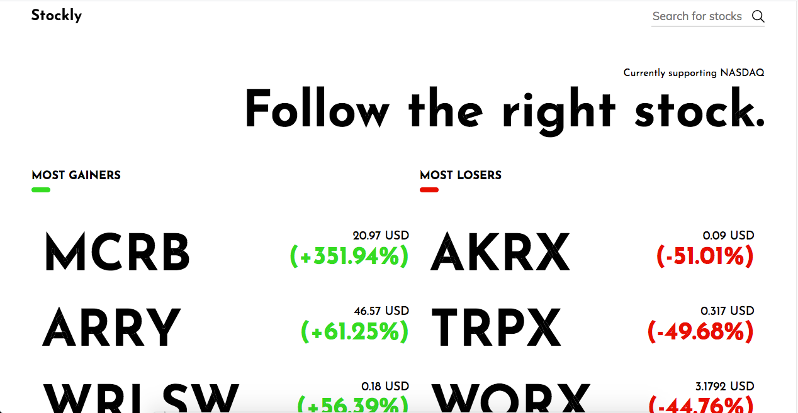
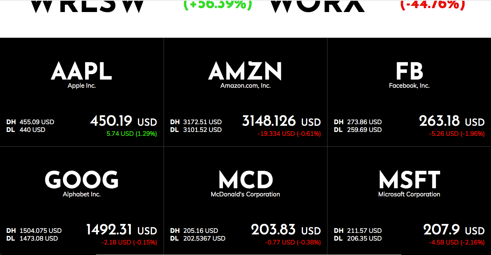

  

> Stockly is the go to website to follow / search stocks daily. This is a React based application that fetches a live updated Stocks API to retrieve precise data. This project consists on 2 pages. On the one hand, we have a master page where we can visualize the Most Gainers and Most Losers Lists, and also a main Stocks List which can be filtered. On the other hand, we have a Stock Detail page. Whenever you click on an item on the Stock List, you will be redirected to the Stock Detail page using React Router.

## Live Demo
**API usage is restricted to 250 requests, please be mindful when using the filter search since it
makes 2 requests to the API endpoing**

[Live Demo Version](https://xtrmdarc-stockly.herokuapp.com/#/)

## Built With

- React
- Redux
- React Router
- JS
- HTML
- CSS
- Node.js
- React-DOM
- React-Create-App
- npm
- ES6

## How to install locally

- Clone this project into your local environment. 
- Run the command `npm install` to install all the required dependecies.
- Run the command `npm start`
- Open [http://localhost:3000](http://localhost:3000) to view it in the browser.

## Available Scripts

In the project directory, you can run:

### `npm start`

Runs the app in the development mode. 
Open [http://localhost:3000](http://localhost:3000) to view it in the browser.

The page will reload if you make edits. 
You will also see any lint errors in the console.

### `npm test`

Launches the test runner in the interactive watch mode. 
See the section about [running tests](https://facebook.github.io/create-react-app/docs/running-tests) for more information.

### `npm build`

Builds the app for production to the `build` folder. 
It correctly bundles React in production mode and optimizes the build for the best performance.

The build is minified and the filenames include the hashes. 
Your app is ready to be deployed!

## Authors

👤 **Diego Antonio Reyes Coronado**

- Github: [@xtrmdarc](https://github.com/xtrmdarc)
- Twitter: [@diegoreyesco](https://twitter.com/DiegoAn91629127)
- Linkedin: [diegoreyesco](https://www.linkedin.com/in/diego-reyes-coronado)

## 🤝 Contributing

Contributions, issues and feature requests are welcome!

Feel free to check the [issues page](https://github.com/xtrmdarc/stockly/issues).

## Show your support

Give a ⭐️ if you like this project!
